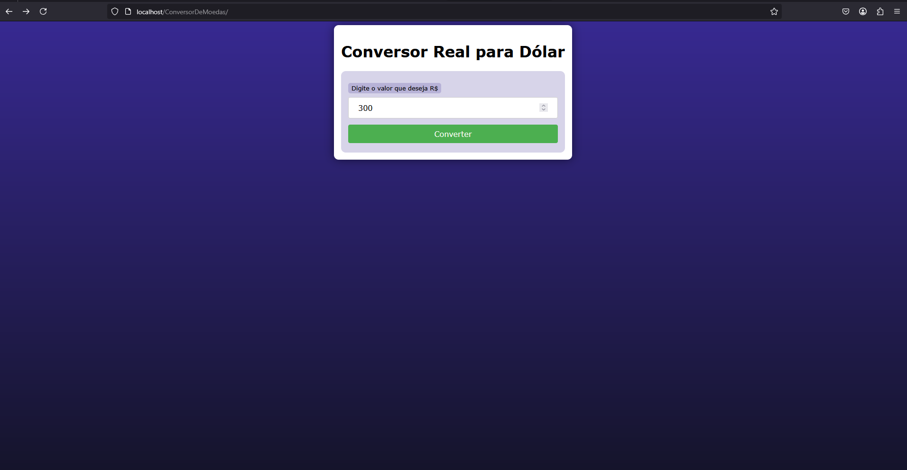
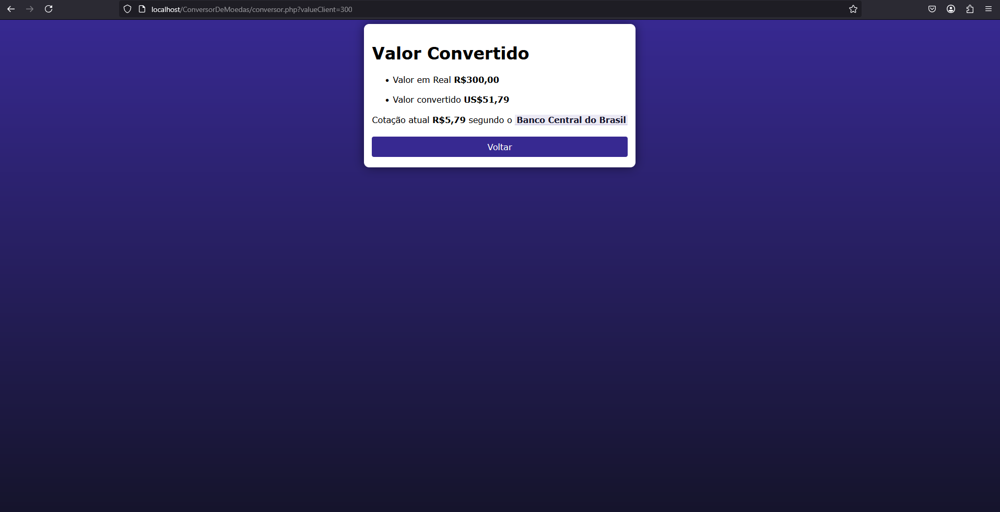

# 💱 Conversor de Moedas: Real para Dólar 💵

Este é um conversor de moedas desenvolvido em **PHP** que permite a conversão de valores em Reais (BRL) para Dólares Americanos (USD). O projeto utiliza a **API do Banco Central do Brasil** para obter a taxa de câmbio atual e realizar a conversão de forma precisa e confiável.

---

## 🚀 Funcionalidades

- **Conversão de Moedas**: Converte valores em Reais (BRL) para Dólares Americanos (USD) com base na taxa de câmbio atual.
- **Integração com API do Banco Central**: Utiliza a API oficial do Banco Central do Brasil para obter a taxa de câmbio em tempo real.
- **Interface Simples e Intuitiva**: Duas páginas fáceis de usar: uma para inserir o valor e outra para exibir o resultado.
- **Link para o Site do Banco Central**: Após a conversão, o usuário pode acessar diretamente o site do Banco Central para mais informações.

---

## 🖼️ Aparência e Funcionamento

### Inserir o Valor
Na primeira página, o usuário insere o valor em Reais (BRL) que deseja converter. A interface é limpa e focada na usabilidade.

---

### Resultado da Conversão
Após inserir o valor, o sistema exibe o valor convertido em Dólares (USD) com base na taxa de câmbio atual. Além disso, um link direto para o site do Banco Central é fornecido para consultas adicionais.

